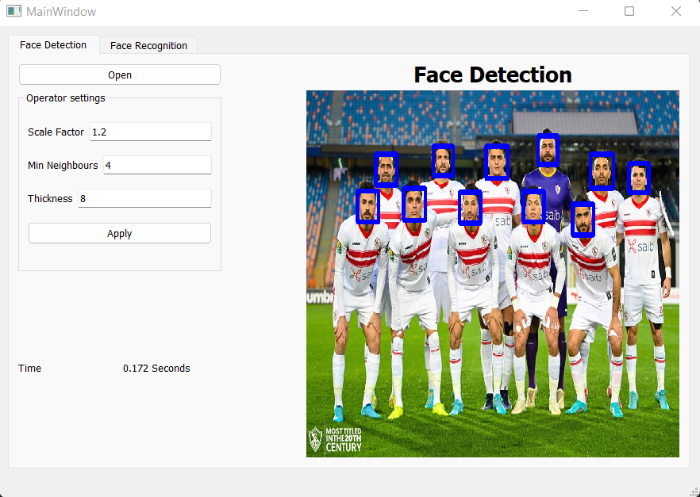

# PCA
## Face Detection

#### function parameters:
* img : ndarray of the image.
* Scale_factor :  Parameter specifying how much the image size is reduced at each image scale.
* minNeighbors :Parameter specifying how many neighbors each candidate rectangle should have to retain it.
* thickness :Parameter specifying the thickness of rectangle which will be drawn around the detected face
### Result :

## ROC 

#### roc & auc were made from scratch by making a cunfusion matrix for the tested cases, which are multi classes, then calculate sensitivity vs specificity 
#### roc x axis is represnted by 1 - specificity, while the y axis is represnted by sensitivity.
#### for making multi class roc, we had to get each class related with the rest of classes.

### Results

#### for auc, classes 0,1,2 and 3 has auc score equal 1.0, 0.7857142857142857, 0.9761904761904762 and 0.9523809523809523 respectively.

#### for roc curves, the resulted plot is as shown in the following plot:

