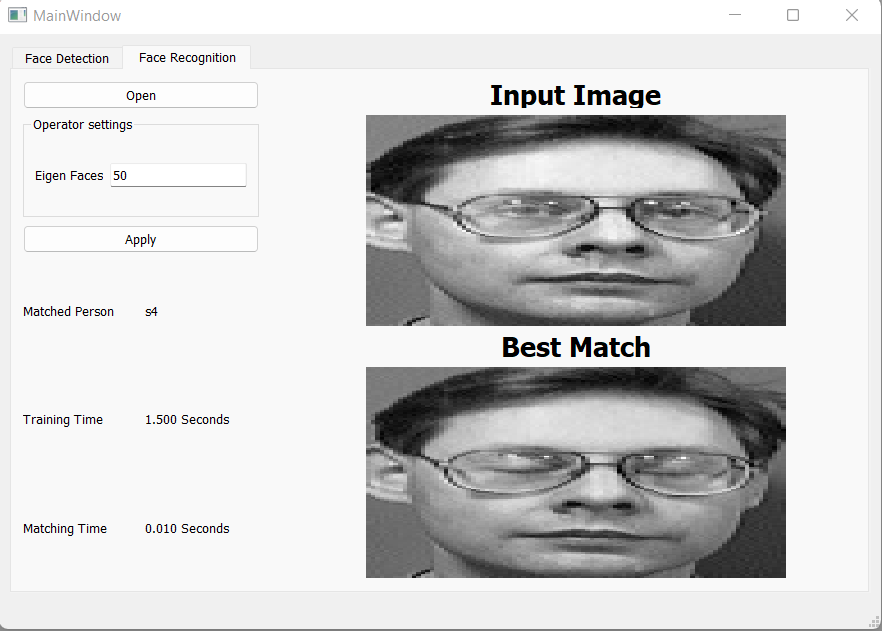

# Face recognition with eigen faces
The objective of this project is to highlight the importance of linear algebra in the field of computer vision and face recognition. Eigenface is the name of a set of eigenvectors computed from an image dataset. Eigenvectors is a set of features which characterize the global variation among face images.The basis of the eigenfaces method is the Principal Component Analysis (PCA).PCA is a dimensionality-reduction method that is often used to reduce the dimensionality of large data sets, by transforming a large set of variables into a smaller one that still contains most of the information in the large set. Roc & auc were made from scratch by making a cunfusion matrix for the tested cases, which are multi classes, then calculate sensitivity vs specificity.

## Getting Started
1. From the command line create a virtual environment and activate.

```sh
# Windows
> python -m venv .venv
> .venv\Scripts\activate

# Linux
> python3 -m venv .venv
> source .venv/bin/activate
```

2. Install the dependencies.
```sh
> pip install -r requirements.txt
```

3. Run the application.
```sh
> python app.py
```

## Screen Shots :




## ROC Results
#### roc x axis is represnted by 1 - specificity, while the y axis is represnted by sensitivity.
#### for making multi class roc, we had to get each class related with the rest of classes.
#### for auc, classes 0,1,2 and 3 has auc score equal 1.0, 0.7857142857142857, 0.9761904761904762 and 0.9523809523809523 respectively.

#### for roc curves, the resulted plot is as shown in the following plot:


## Code Architecture
The code mainly consists of three functions as following :

**train_data(data_path : str , eigen_faces_num : int)**
- Description: training function
- Parameters:
    1. `data_path` : The directory for the Images to train
    2. `eigen_faces_num` : Number of the eigen faces that the model should consider
- Return : 
    1. `projections` 
    2. `mean_img` : The mean Image for the images
    3. `eigen_faces` : The calculated eigen vectors
    4. `images`

**recog_face(test_path,projections,mean_img,eigen_faces,images,eigen_faces_num,thres)**

- Description: Predict the class of a given image
- Parameters:
    1. `test_path` : Path to the image
    2. `projections` : these are the projections coming from the above function 
    3. `mean_img` : Mean Image
    4. `eigen_faces` : calculated eigen vectors
    5. `images` : Images obtained from the above function
    6. `eigen_faces_num` : number of the eigen vectors
    7.  `thres` : threshold
- Return : `void`

**detect_faces(img,scale_factor,minNeighbors,thickness)**
- Description: detect faces in Image
- Parameters: 
    1. `img` : nparray of the image
    2. `Scale_factor` : Parameter specifying how much the image size is reduced at each image scale
    3. `minNeighbors` : Parameter specifying how many neighbors each candidate rectangle should have to retain it
    4. `thickness` : Parameter specifying the thickness of rectangle which will be drawn around the detected face

